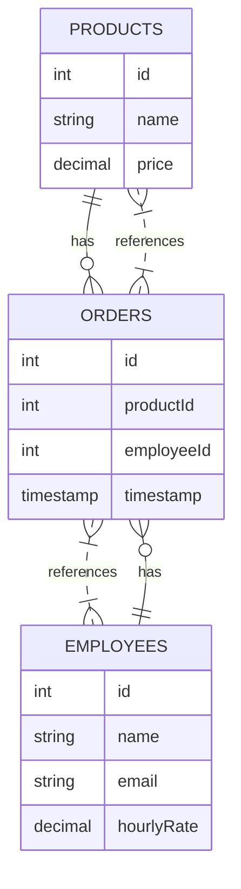

# ERD

```mermaid
erDiagram
    PRODUCTS ||--o{ ORDERS : has
    EMPLOYEES ||--o{ ORDERS : has
    ORDERS }|..|{ PRODUCTS : references
    ORDERS }|..|{ EMPLOYEES : references
    PRODUCTS {
        int id
        string name
        decimal price
    }
    EMPLOYEES {
        int id
        string name
        string email
        decimal hourlyRate
    }
    ORDERS {
        int id
        int productId
        int employeeId
        timestamp timestamp
    }
```