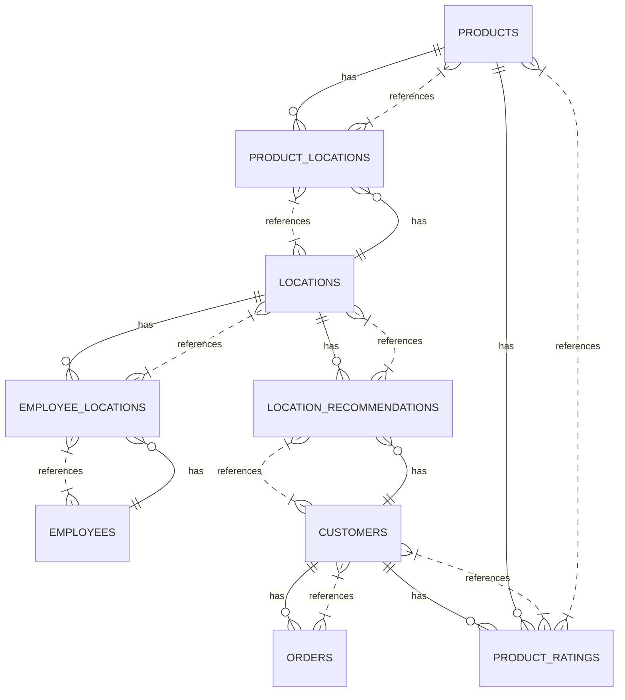

# Expanded ERD

**Note**: The ERD assumes that each customer can have multiple credit card numbers stored, and that each product can have multiple ratings, coming from different customers. Additionally, each location can have multiple recommendations from different customers.